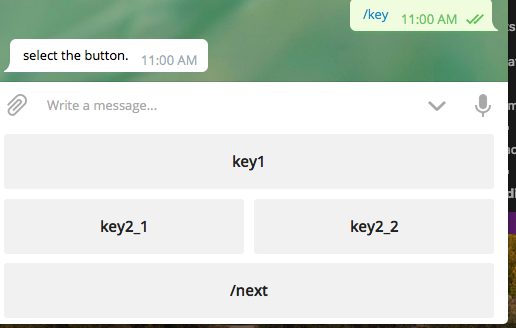
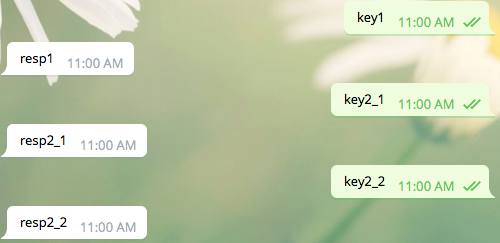
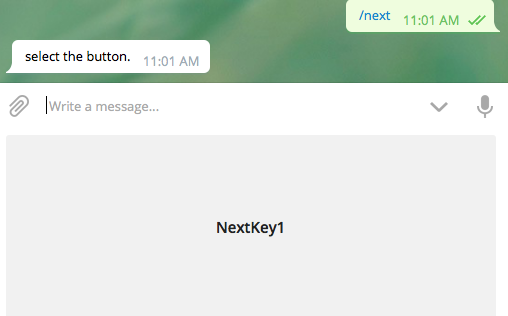
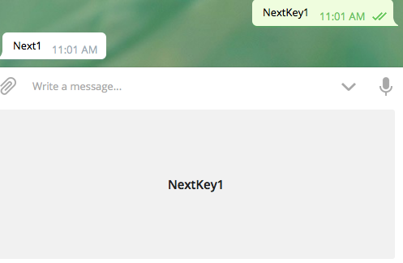

# remiit-telegram-bot-node

## Guide

### Install
1. git clone    
2. install nodejs (recommended version 8.11.3 LTS), npm (if you installed LTS nodejs, npm is already accompanied with it.)
3. `npm install`
4. Place your token.json file on the path `${project_root_dir}/config/token.json`
   * token.json file form example
        ```json
        {
            "token" : "token_strings_1239128749oihsdfklhsdlfhasj"
        }
        ```
   * token is published by BotFather of telegram chatting `/newbot` command. 

### RUN
1. move project root directory
2. `npm start'
3. If you want test, run `npm test`

### Telegram chat configuration
1. You have to `/setprivacy` chatting in the BotFather chat. Then, select your bot and select disable option.
2. If you want manage your group chat using this bot, you have to give the administrator authority to bot.

## Functions & Configuration
Each function has at least one configuration. You can configure bot using config/config.json file.

### Bot generated message auto remove.
Bot generated message has queue. If you configure the `"queue"` field.
 * `"queueBound"` : means the auto remove target queue size. If bot generated message count is upper than this value, bot remove oldest message queueBatchRemoveSize count.
 * `"queueBatchRemoveSize"` : means the remove message size.

### Welcome Message
You can welcome message if new member join the chat includes bot. 
This configuration is `"welcome"` field.
1. `"welcomePreMsg"` : This message is prefix of user name who joined.
2. `"welcomePostMsg"` : This message is postfix of user name who joined.

Example : If user 'Joey Lee' has joined, welcomePreMsg is 'hi' and welcomePostMsg is 'Welcome.'.
 * `hi, Joey Lee. Welcome.` 
 
### Filter
If Bot has administrator authority in the chat, bot filter and remove the message which contains at least one filtering target.
This configuration is `"filter"` field.
 * `"filterResponseMessage"` : The message bot send in the chat if a user send filtering target message.
 
Filtering target is bellow.
 * audio
 * video
 * link
 * document(file)
 * photo
 
### Funny talk
If you want to refresh your chat, use funny talk. 
If chat message contains key string, bot response the value message on the chat.
This configuration is `"funnyTalk"` field.

Example
 * example json
 ```json
 "funnyTalk": {
     "query1": "hahaha",
     "query2": "merong!! >.<!"
   }
 ```
 * If a user send message contains "query1", bot response "hahaha".
 * If a user send message contains "query2", bot response "merong!! >.<!".

 
### Keyboard
Keyboard function run only in the private chat with bot.
This configuration is `"keyboard"` field.

You have to stick to rules follow.
 * Keys in the keyboard value object start with `/` string. This means pre-defined command in the telegram.
 * The value of each key must have array object.
 * Each array object must have json object, not array object.
 * If you want to generate next step of keyboard, you have to make new key in the keyboard value object. Do not more depth than one of each value.
 
Keyboard Example
```json
"keyboard": {
    "\/key": [
      {
        "key1": "resp1"
      },
      [
        {
          "key2_1": "resp2_1"
        },
        {
          "key2_2": "resp2_2"
        }
      ],
      {
        "\/next" : "please press next button."
      }
    ],
    "\/next" : [
      {
        "NextKey1": "Next1"
      }
    ]
  }
```

This keyboard view function examples are follow.




